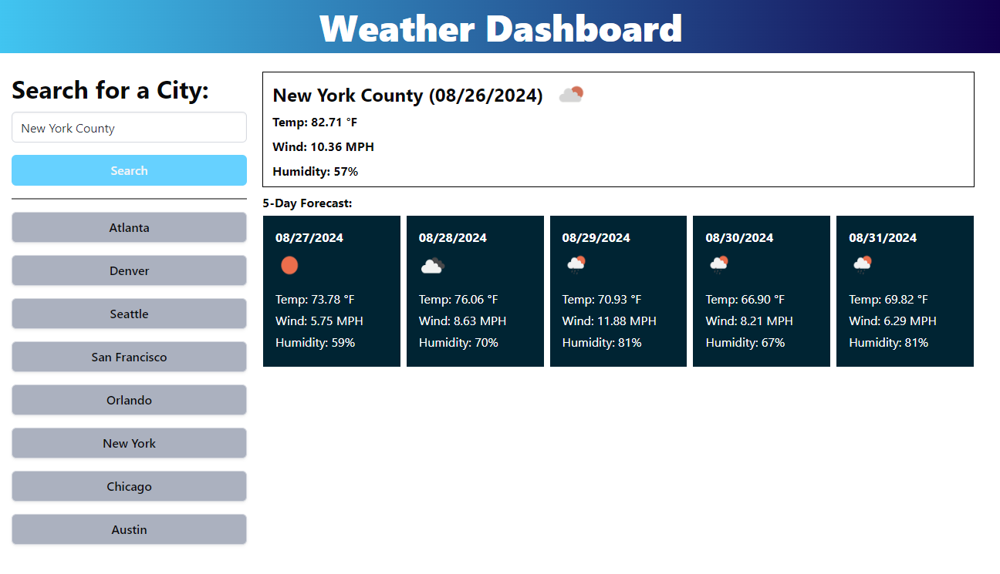

# 06c-Weather-Dashboard

## Description

Prudent travelers and non-travelers alike prefer to gather information to prepare for the days ahead. One way to do this is by checking the weather forecast. This weather dashboard provides a handy way to check the current weather and upcoming 5-day forecast for almost any city in the world. Whether you're planning a trip to the grocery store or a vacation to Seoul, having accurate weather information with which to prepare oneself can certainly make the journey more enjoyable.

## Installation

The webpage can be accessed here:
https://qbres333.github.io/06c-Weather-Dashboard/

The online repository with all code files can be accessed here:
https://github.com/qbres333/06c-Weather-Dashboard

## Usage

This app can be used by any person who wants to plan their outdoor activities for the current day, or for the next 5 days.

The following image shows the web application's appearance and functionality:

## Features

By typing in the city name using Latin alphabet letters, in any letter case, weather data is retrieved from the API. Non-letter inputs into the search field do not produce any output.

## Credits

Bulma CSS documentation:
https://bulma.io/documentation/

DayJS documentation:
https://day.js.org/docs/en/installation/installation

JQuery documentation:
https://api.jquery.com/

## License

MIT License (located in root directory):
https://github.com/qbres333/06c-Weather-Dashboard
